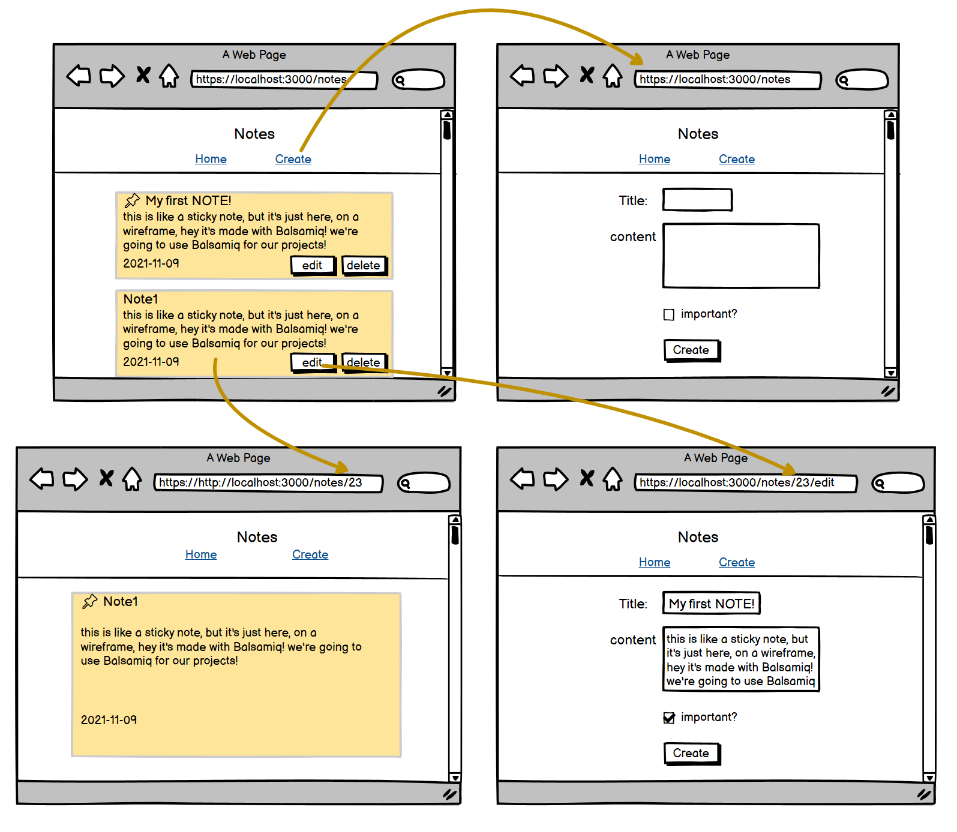

# Belt Review for MERN

## Wireframe

## Setup
- server dependencies: express, mongoose, cors, dotenv
- client dependencies: react-router-dom, axios

<!-- ## Requirements
1. Dashboard: Show the list of all jobs
2. Create: redirect to dashboard upon successful form submission
3. Create: Shows the backend validation errors on the form for any failed fields. 
4. Update: redirect to detail page upon successful update
5. Delete: When the Delete button on dashboard is clicked, the list will be updated. 
6. Delete: When the Delete button on Edit is clicked, redirect to the dashboard.  -->